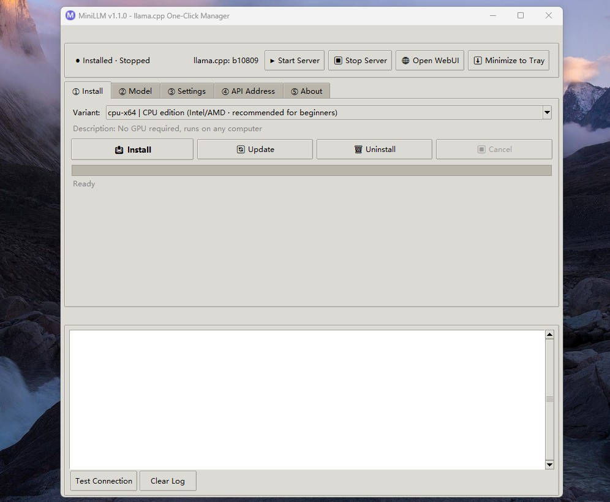

# MiniLLM A one-click desktop manager for **llama.cpp** on Windows. No coding required — install, start the server, and chat with your model through a local API in seconds.

- **Author**: Bashige

## Features

- **One-click install / update / uninstall** of llama.cpp variants (CPU, Vulkan, CUDA, SYCL, ROCm, OpenVINO)
- **One-click start / stop** the llama-server
- **Copy API URL and Model ID** with one click
- **Model directory settings** — browse and select `.gguf` model files
- **Sampling parameters** — temperature, top_p, top_k, min_p, repeat_penalty, n_predict, seed with presets (Chat / Code)
- **Minimize to system tray** — run in the background
- **Single-instance enforcement** — only one MiniLLM process allowed
- **No code required** — fully graphical, everything is one click

## Download

Download the latest release: [MiniLLM.exe]([MiniLLM.exe](https://github.com/bashigestudio/MiniLLM/releases/tag/MiniLLM)) (approximately 31 MB).

## Quick Start

1. **Install llama.cpp**: Open MiniLLM → select a variant → click **Install**
2. **Select a model**: Set the model directory → place your `.gguf` file there
3. **Start the server**: Click **▶ Start Server**
4. **Open WebUI**: Click **🌐 Open WebUI** to chat in your browser
5. **Use the API**: The local API is available at `http://127.0.0.1:8080`

## Supported Variants

| Variant | Description |
|---------|-------------|
| CPU (x64) | Intel/AMD, no GPU required |
| Vulkan | AMD / NVIDIA / Intel integrated GPU |
| CUDA 12.4 | NVIDIA, legacy drivers |
| CUDA 13.3 | NVIDIA, new drivers |
| CPU (ARM64) | Snapdragon / ARM laptops |
| SYCL | Intel Arc GPU |
| ROCm | AMD GPU (experimental) |
| OpenVINO | Intel CPU / integrated GPU |

## Configuration

Settings are stored in `%APPDATA%/MiniLLM/config.json`. The app remembers your variant, model directory, sampling parameters, and tray preferences.

## Requirements

- **Windows** 10/11
- **Python 3.12** (for source builds)
- **Pillow**, **PyInstaller** (for building the executable)
- **llama.cpp** binaries are downloaded automatically

## License

MIT License
